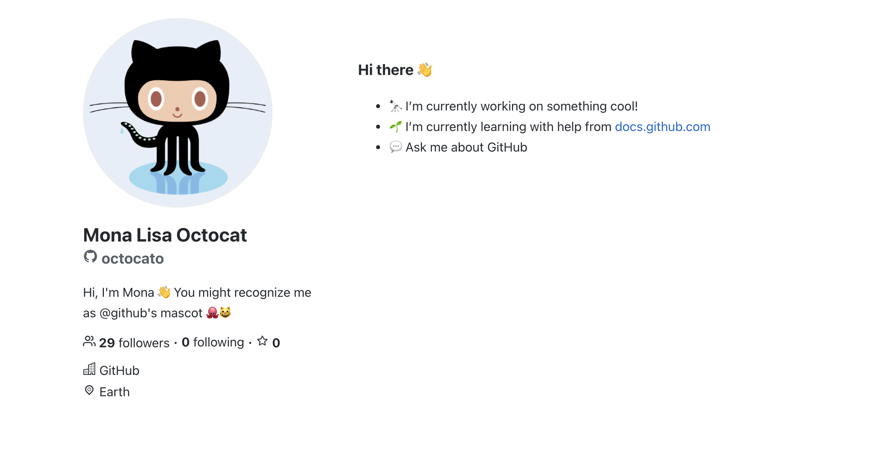
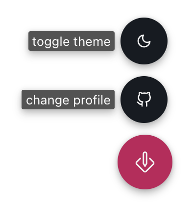

# 🚀 GitHub Personal Website Generator

> Use your GitHub profile to create a personal website

[Demo page](https://www.aabuhijleh.com/)

<p align="center">
    
</p>

## How it works?

GitHub REST API is used to download your [profile README](https://docs.github.com/en/github/setting-up-and-managing-your-github-profile/managing-your-profile-readme) and [user data](https://docs.github.com/en/rest/reference/users#get-a-user). That information is then used to generate the website content.

## Try it out

By default, it uses my profile [`aabuhijleh`](https://github.com/aabuhijleh) as found in `src/defaults.ts`

To use a different profile

```
/?username={username}
```

Or use the UI provided by the website

<p>
    
</p>

## Development

This project was bootstrapped with [Create React App](https://github.com/facebook/create-react-app)

```sh
# install dependencies
$ npm install

# run the app in development
$ npm start

# build the app for production
$ npm run build
```
